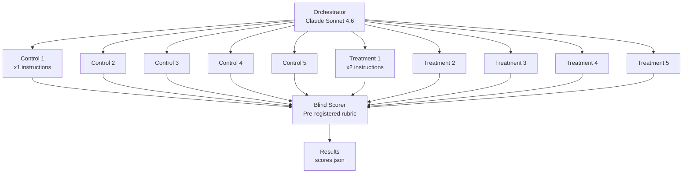

<div align="center">

# Prompt Repetition Experiments

[](LICENSE)
[](https://github.com/clouatre-labs/prompt-repetition-experiments)
[](experiments/)
[](experiments/)

Does repeating instructions make AI agents more accurate? We tested it. 20 parallel delegates across 2 experiments say: **no, well-scoped engineering tasks already hit ceiling accuracy.**

Supplementary materials for [What a Null Result Taught Us About AI Agent Evaluation](https://clouatre.ca/posts/prompt-repetition-agent-evaluation/).

</div>

## The Question

[Leviathan et al. (2025)](https://arxiv.org/abs/2502.07869) showed that repeating instructions in LLM prompts improves accuracy on positional retrieval tasks. Does this translate to structured engineering tasks executed by AI agent delegates?

```text
Experiment setup:
  Orchestrator (Claude Sonnet 4.6)
  ├── Control group:    5 delegates with standard instructions (x1)
  ├── Treatment group:  5 delegates with repeated instructions (x2)
  └── Blind scorer:     Rubric-based evaluation (sealed before scoring)

  x2 experiments = 20 delegates total
```

## Results

See [METHODOLOGY.md](METHODOLOGY.md) for experimental design, rubrics, and statistical methods.

### Experiment 1: FastMCP Session ID Refactor (Source Analysis)

| Group | Runs | Mean Score | Max Score | Ceiling Criteria |
|-------|------|------------|-----------|------------------|
| Control (x1) | 4 valid | 5.5/6 | 6/6 | 5 of 6 at 100% |
| Treatment (x2) | 5 valid | 5.8/6 | 6/6 | 5 of 6 at 100% |

One control run excluded (drift failure at 93 messages, no output produced).

### Experiment 2: Tree-sitter AST Scanner (Code Synthesis)

| Group | Runs | Mean Score | Max Score | Ceiling Criteria |
|-------|------|------------|-----------|------------------|
| Control (x1) | 5 | 7.0/7 | 7/7 | 7 of 7 at 100% |
| Treatment (x2) | 5 | 7.0/7 | 7/7 | 7 of 7 at 100% |

Perfect scores across all runs. Complete ceiling effect.

### Summary

| | Experiment 1 | Experiment 2 |
|---|---|---|
| **Task** | FastMCP session ID refactor analysis | Tree-sitter AST scanner code synthesis |
| **Repo** | clouatre-labs/math-mcp-learning-server#222 | clouatre-labs/aptu#737 |
| **Type** | Source analysis (read-only) | Code generation (write) |
| **Groups** | 5 control, 5 treatment | 5 control, 5 treatment (blinded run IDs) |
| **Rubric** | 6 binary criteria | 7 binary criteria |
| **Result** | 5/6 criteria at 100% both groups | 7/7 criteria at 100% both groups |
| **Valid runs** | 9 of 10 (1 drift failure) | 10 of 10 |

**Conclusion:** No detectable difference between x1 and x2 instruction conditions. Both experiments exhibited ceiling effects, making treatment effects unmeasurable. The null result suggests prompt repetition addresses positional attention decay, a problem that well-scoped engineering tasks with structured outputs do not have.

---

## Experiment Flow



All delegates run on Claude Haiku 4.5 at temperature 0.5. The orchestrator spawns delegates in parallel, subject to a 5-delegate concurrency cap discovered during experimentation.

---

## Infrastructure Confound

The experiments uncovered an undocumented 5-delegate concurrency cap in [Goose](https://github.com/block/goose). This caused unbalanced batching:

```text
Experiment 2 timeline:
  22:15:00  Batch 1 spawned: run-01 through run-05  (5 delegates)
  22:15:01  Cap hit. Queued: run-06 through run-10
  22:19:00  Batch 1 completes
  22:19:01  Batch 2 spawned: run-06 through run-10  (5 delegates)
  22:23:00  Batch 2 completes
```

Batch 2 delegates had stale context (4 minutes older). The raw orchestrator logs in `experiments/*/raw/orchestrator.jsonl` show this behavior.

---

## Project Structure

```text
prompt-repetition-experiments/
  README.md                    # This file
  METHODOLOGY.md               # Experimental design, rubrics, scoring protocol
  LICENSE                      # Apache 2.0
  recipe/
    goose-coder-v4.1.0.yaml         # Goose recipe used for orchestration
  experiments/
    exp1-fastmcp-refactor/
      analysis.json                  # Aggregated results and per-run metadata
      scores.json                    # Blind scorer output with justifications
      label-map.json                 # Group assignments (sealed before scoring)
      sessions/                      # Structured delegate outputs (scored artifacts)
        scout-control-{2..5}.json    # Control group (1 excluded: drift)
        scout-treatment-{1..5}.json  # Treatment group
      raw/                           # Full conversation logs (sanitized)
        orchestrator.jsonl           # Experiment orchestration (265 messages)
        scorer.jsonl                 # Blind scoring session
        scout-control-{1..5}.jsonl   # Control delegate conversations
        scout-treatment-{1..5}.jsonl # Treatment delegate conversations
    exp2-treesitter-synthesis/
      analysis.json                  # Aggregated results and per-run metadata
      scores.json                    # Blind scorer output with justifications
      label-map.json                 # Group assignments (sealed before scoring)
      sessions/                      # Structured delegate outputs (scored artifacts)
        scout-run-{01..10}.json      # Blinded run IDs
      raw/                           # Full conversation logs (sanitized)
        orchestrator.jsonl           # Experiment orchestration (419 messages)
        scorer.jsonl                 # Blind scoring session
        setup.jsonl                  # Experiment setup session
        utility-{1..2}.jsonl         # Utility sessions
        scout-run-{01..10}.jsonl     # Delegate conversations (blinded)
        scout-run-08-retry.jsonl     # Retry of run-08
```

## Data Files

### Recipe

- **`recipe/goose-coder-v4.1.0.yaml`** -- The Goose recipe defining the Scout/Guard subagent architecture. Scouts run on `claude-haiku-4-5` at temperature 0.5 with extended thinking off.

### Per-Experiment Files

- **`analysis.json`** -- Experiment metadata: issue reference, model, dates, per-run timing/token counts, aggregate statistics, and statistical tests.
- **`scores.json`** -- Blind scorer output: per-criterion binary scores (0/1) with natural-language justifications for each run.
- **`label-map.json`** -- Group assignments sealed before scoring began. Maps run IDs to control/treatment groups.
- **`sessions/*.json`** -- Structured delegate outputs. Each file contains the research findings produced by one Scout delegate. These are the artifacts scored by the rubric.
- **`raw/*.jsonl`** -- Full message-by-message conversation logs exported from Goose's session database. Includes tool calls, intermediate reasoning, and errors. Home directory paths sanitized to `$EXPERIMENTER_HOME`. Orchestrator logs show the 5-delegate concurrency cap in action.

### Inspecting the Data

```bash
# View experiment 1 scores
jq '.scores[] | {run_id, total}' experiments/exp1-fastmcp-refactor/scores.json

# View experiment 2 group assignments
jq '.assignments' experiments/exp2-treesitter-synthesis/label-map.json

# Compare control vs treatment totals
jq -r '.scores[] | "\(.run_id)\t\(.total)"' experiments/exp1-fastmcp-refactor/scores.json

# Count messages in orchestrator log
wc -l experiments/exp1-fastmcp-refactor/raw/orchestrator.jsonl
```

Exact reproduction requires access to the target repositories at the commit SHAs recorded in each `analysis.json`.

---

## Citation

```bibtex
@misc{clouatre2026promptrepetition,
  title   = {What a Null Result Taught Us About AI Agent Evaluation},
  author  = {Clouatre, Hugues},
  year    = {2026},
  url     = {https://clouatre.ca/posts/prompt-repetition-agent-evaluation/},
  note    = {Supplementary materials: https://github.com/clouatre-labs/prompt-repetition-experiments}
}
```

## License

[Apache License 2.0](LICENSE)
