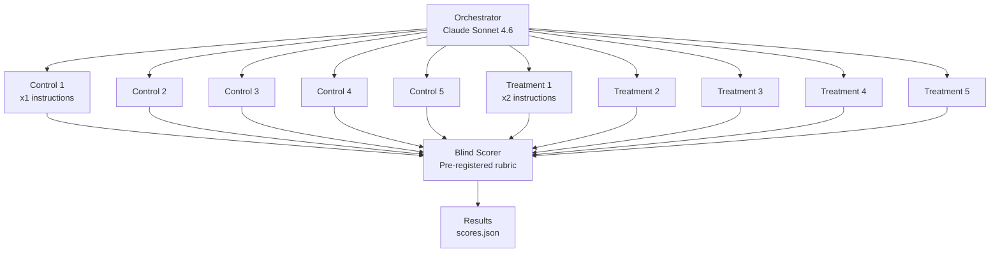

<div align="center">

# Prompt Repetition Experiments

[](LICENSE)
[](https://github.com/clouatre-labs/prompt-repetition-experiments)
[](experiments/)
[](experiments/)

Does repeating instructions make AI agents more accurate? We tested it. 20 parallel delegates across 2 experiments say: **no, well-scoped engineering tasks already hit ceiling accuracy.**

Supplementary materials for [What a Null Result Taught Us About AI Agent Evaluation](https://clouatre.ca/posts/prompt-repetition-agent-evaluation/).

</div>

---

## The Question

[Leviathan et al. (2025)](https://arxiv.org/abs/2502.07869) showed that repeating instructions in LLM prompts improves accuracy on positional retrieval tasks. Does this translate to structured engineering tasks executed by AI agent delegates?

```text
Experiment setup:
  Orchestrator (Claude Sonnet 4.6)
  +-- Control group:    5 delegates with standard instructions (x1)
  +-- Treatment group:  5 delegates with repeated instructions (x2)
  +-- Blind scorer:     Rubric-based evaluation (sealed before scoring)

  x2 experiments = 20 delegates total, 4,179 messages, 28 session logs
```

---

## Scoring Rubric

Each delegate's output was scored against a pre-registered binary rubric (0/1 per criterion). Rubrics were locked before any delegates were spawned.

### Experiment 1: FastMCP Session ID Refactor (6 criteria)

```text
C1  Source file identified: persistence.py           (information retrieval)
C2  Source file identified: calculate.py             (information retrieval)
C3  Anti-pattern found: id(ctx.lifespan_context)     (pattern recognition)
C4  Replacement API: ctx.set_state / ctx.get_state   (API research)
C5  Must-Not constraint: non-serializable values     (constraint capture)
C6  FastMCP docs consulted: gofastmcp.com            (external verification)
```

### Experiment 2: Tree-sitter AST Scanner (7 criteria)

```text
C1  SecurityScanner implementation file identified   (codebase navigation)
C2  Line-by-line regex limitation understood          (constraint recognition)
C3  tree-sitter-rust version verified via Cargo.toml  (version verification)
C4  Hybrid vs. full-migration tradeoff articulated    (synthesis + judgment)
C5  2+ patterns requiring multi-line detection named  (source code reading)
C6  Data-flow/taint tracking gap noted                (architectural reasoning)
C7  Binary size / grammar crate count estimated       (quantitative analysis)
```

C5-C7 in Experiment 2 require reading and synthesizing actual source code. They cannot be answered from the issue text alone.

---

## Results

### Experiment 1: FastMCP Session ID Refactor

```text
Run           C1  C2  C3  C4  C5  C6  Total
control-2      1   1   1   1   1   1   6/6
control-3      1   1   1   1   1   1   6/6
control-4      1   1   1   1   0   1   5/6
control-5      1   1   1   1   0   1   5/6
Control avg                             5.50/6

treatment-1    1   1   1   1   1   1   6/6
treatment-2    1   1   1   1   0   1   5/6
treatment-3    1   1   1   1   1   1   6/6
treatment-4    1   1   1   1   1   1   6/6
treatment-5    1   1   1   1   1   1   6/6
Treatment avg                           5.80/6

Delta: +0.30 (not significant, n=4/5 per group)
```

One control run excluded (drift failure at 93 messages, no output produced). C5 was the only discriminating criterion; all others scored 100% in both groups.

### Experiment 2: Tree-sitter AST Scanner

```text
Run       C1  C2  C3  C4  C5  C6  C7  Total
run-01     1   1   1   1   1   1   1   7/7
run-02     1   1   1   1   1   1   1   7/7
run-03     1   1   1   1   1   1   1   7/7
run-04     1   1   1   1   1   1   1   7/7
run-05     1   1   1   1   1   1   1   7/7
run-06     1   1   1   1   1   1   1   7/7
run-07     1   1   1   1   1   1   1   7/7
run-08     1   1   1   1   1   1   1   7/7
run-09     1   1   1   1   1   1   1   7/7
run-10     1   1   1   1   1   1   1   7/7

Mann-Whitney U = 12.5, p = 1.0 (degenerate: all scores identical)
```

Perfect scores across all 10 runs. Complete ceiling effect. The rubric was designed to be harder (C5-C7 require source code synthesis), but Claude Haiku 4.5 with structured Scout instructions cleared every criterion regardless of repetition.

### Summary

| | Experiment 1 | Experiment 2 |
|---|---|---|
| **Task** | FastMCP session ID refactor analysis | Tree-sitter AST scanner evaluation |
| **Repo** | clouatre-labs/math-mcp-learning-server#222 | clouatre-labs/aptu#737 |
| **Type** | Source analysis (read-only) | Code synthesis (write) |
| **Groups** | 5 control, 5 treatment | 5 control, 5 treatment (blinded IDs) |
| **Rubric** | 6 binary criteria | 7 binary criteria |
| **Result** | 5/6 criteria at 100% both groups | 7/7 criteria at 100% both groups |
| **Valid runs** | 9 of 10 (1 drift failure) | 10 of 10 |

**Conclusion:** No detectable difference between x1 and x2 instruction conditions. Both experiments exhibited ceiling effects, making treatment effects unmeasurable. The null result suggests prompt repetition addresses positional attention decay -- a problem that well-scoped engineering tasks with structured outputs do not have.

---

## Experiment Flow



All delegates run on Claude Haiku 4.5 at temperature 0.5. The orchestrator spawns delegates in parallel, subject to a 5-delegate concurrency cap discovered during experimentation.

---

## Infrastructure Confound

Goose enforces an undocumented 5-delegate concurrency cap. With 10 delegates, execution splits into two sequential batches:

```text
Experiment 2 timeline:
  22:15:00  Batch 1 spawned: run-01 through run-05  (5 delegates)
  22:15:01  Cap hit. Queued: run-06 through run-10
  22:19:00  Batch 1 completes
  22:19:01  Batch 2 spawned: run-06 through run-10  (5 delegates)
  22:23:00  Batch 2 completes
```

Batch 2 delegates had stale context (4 minutes older). The raw orchestrator logs in `experiments/*/raw/orchestrator.jsonl` show this behavior.

---

## Inspecting the Data

```bash
# View per-run scores with justifications
jq '.scores[] | {run_id, total, justifications}' \
  experiments/exp1-fastmcp-refactor/scores.json

# Reveal group assignments (sealed before scoring)
jq '.assignments' experiments/exp2-treesitter-synthesis/label-map.json

# Compare control vs treatment totals side by side
jq -r '.scores[] | "\(.run_id)\t\(.total)"' \
  experiments/exp1-fastmcp-refactor/scores.json

# Count messages per session in raw logs
wc -l experiments/exp1-fastmcp-refactor/raw/*.jsonl

# Read a specific delegate's full conversation
cat experiments/exp2-treesitter-synthesis/raw/scout-run-01.jsonl | \
  python3 -c "import json,sys; [print(json.dumps(json.loads(l),indent=2)) for l in sys.stdin]" | \
  less
```

---

## Project Structure

```text
prompt-repetition-experiments/
  README.md                          # This file
  METHODOLOGY.md                     # Experimental design, rubrics, scoring protocol
  LICENSE                            # Apache 2.0
  recipe/
    goose-coder-v4.1.0.yaml               # Goose recipe (Scout/Guard architecture)
  experiments/
    exp1-fastmcp-refactor/
      protocol.md                          # Pre-registered experimental protocol
      analysis.json                        # Per-run metadata, timing, token counts
      scores.json                          # Blind scorer output with justifications
      label-map.json                       # Group assignments (sealed before scoring)
      sessions/                            # Structured delegate outputs (scored artifacts)
        scout-control-{2..5}.json          # Control group (1 excluded: drift)
        scout-treatment-{1..5}.json        # Treatment group
      raw/                                 # Full conversation logs (sanitized)
        orchestrator.jsonl                 # 265 messages
        scorer.jsonl                       # Blind scoring session
        scout-control-{1..5}.jsonl         # Control delegate conversations
        scout-treatment-{1..5}.jsonl       # Treatment delegate conversations
    exp2-treesitter-synthesis/
      protocol.md                          # Pre-registered experimental protocol
      analysis.json                        # Per-run metadata, timing, token counts
      scores.json                          # Blind scorer output with justifications
      label-map.json                       # Group assignments (sealed before scoring)
      sessions/                            # Structured delegate outputs (scored artifacts)
        scout-run-{01..10}.json            # Blinded run IDs
      raw/                                 # Full conversation logs (sanitized)
        orchestrator.jsonl                 # 419 messages
        scorer.jsonl                       # Scoring session
        setup.jsonl                        # Experiment setup
        utility-{1..2}.jsonl               # Utility sessions
        scout-run-{01..10}.jsonl           # Delegate conversations (blinded)
        scout-run-08-retry.jsonl           # Retry of run-08
```

### Data Files

- **`protocol.md`** -- Pre-registered experimental protocol. Locked before any delegates were spawned. Contains the research question, method, rubric, gate criteria, and pre-acknowledged limitations.
- **`recipe/goose-coder-v4.1.0.yaml`** -- The Goose recipe defining the Scout/Guard subagent architecture. Scouts run on `claude-haiku-4-5` at temperature 0.5.
- **`analysis.json`** -- Experiment metadata: issue reference, model, dates, per-run timing/token counts, aggregate statistics, and statistical tests.
- **`scores.json`** -- Blind scorer output: per-criterion binary scores (0/1) with natural-language justifications for each run.
- **`label-map.json`** -- Group assignments sealed before scoring began. Maps run IDs to control/treatment groups.
- **`sessions/*.json`** -- Structured delegate outputs. Each file contains the research findings produced by one Scout delegate. These are the artifacts scored by the rubric.
- **`raw/*.jsonl`** -- Full message-by-message conversation logs exported from Goose's session database. Includes tool calls, intermediate reasoning, and errors. Home directory paths sanitized to `$EXPERIMENTER_HOME`.

Exact reproduction requires access to the target repositories at the commit SHAs recorded in each `analysis.json`.

---

## Citation

```bibtex
@misc{clouatre2026promptrepetition,
  title   = {What a Null Result Taught Us About AI Agent Evaluation},
  author  = {Clouatre, Hugues},
  year    = {2026},
  url     = {https://clouatre.ca/posts/prompt-repetition-agent-evaluation/},
  note    = {Supplementary materials: https://github.com/clouatre-labs/prompt-repetition-experiments}
}
```

## License

[Apache License 2.0](LICENSE)
