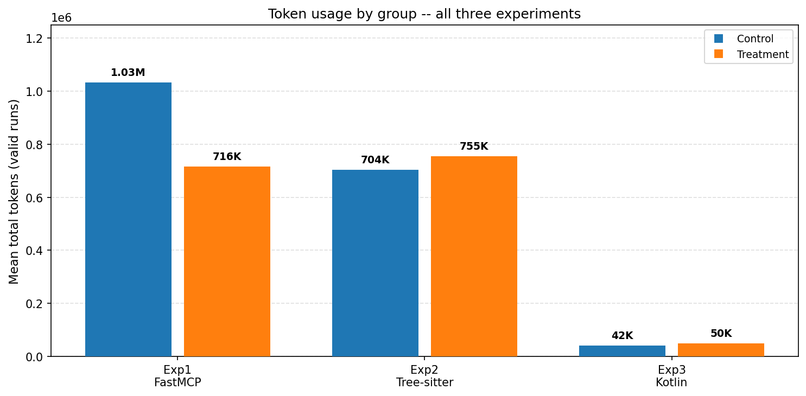
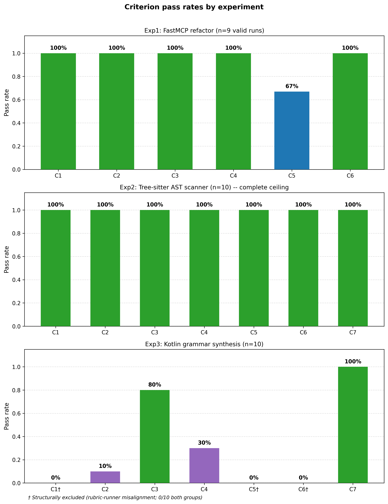
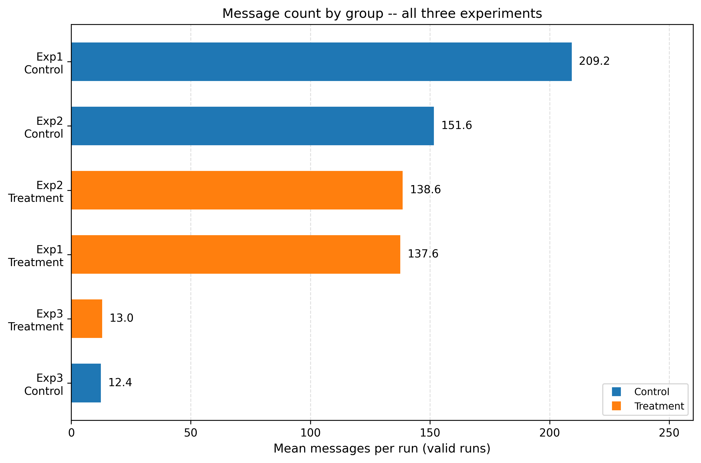
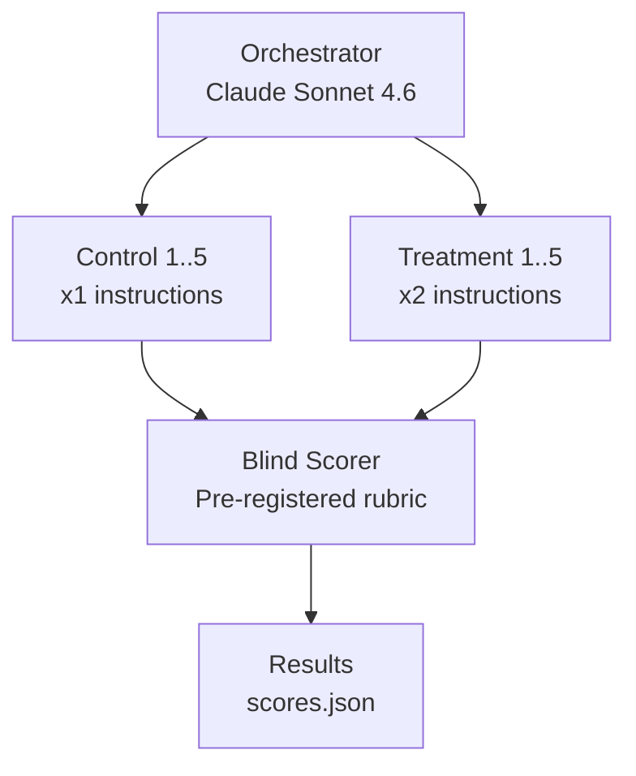

<div align="center">

# Prompt Repetition Experiments

[](https://doi.org/10.5281/zenodo.19057574)
[](LICENSE)
[](experiments/)
[](experiments/)

## Abstract

Prompt repetition (duplicating the input prompt verbatim before the task description) has been shown to improve accuracy for non-reasoning LLMs on positional retrieval and multiple-choice benchmarks (Leviathan et al., 2025). Whether this gain extends to agentic settings involving structured, verifiable software-engineering tasks remains an open question. We present three pre-registered controlled experiments in which Claude Haiku 4.5 agent instances (n=5 per condition, temperature 0.5) were assigned either a single-copy or a repeated-prompt instruction under a blinded binary rubric, totalling 30 session logs and 4,306 messages. In Experiment 1 (session-ID refactoring, 6 binary criteria), the repeated-prompt condition showed a non-significant score delta of +0.30 (Mann-Whitney U, n=9 valid runs); in Experiment 2 (AST-scanner implementation, 7 binary criteria), both conditions achieved perfect scores (7/7), producing a complete performance-saturation effect (U p=1.0) that precluded any treatment comparison; in Experiment 3 (Kotlin grammar synthesis, 7 binary criteria), 3 of 7 rubric criteria were excluded post-hoc (C1, C5, C6) after observing a 0/10 floor across both groups; the root cause was a structural rubric-runner misalignment -- the runner prompt did not ask agents to investigate ABI compatibility, write .kts-specific tests, or inspect LanguageInfo struct fields referenced in PR #659, so those criteria were unreachable regardless of treatment assignment. On the remaining 4 reachable criteria (C2, C3, C4, C7), neither condition exceeded a mean of 2.4/4 (Mann-Whitney U=15, p=0.61), with no significant treatment effect. The exclusion is disclosed as a post-hoc criterion exclusion with structural rationale: the reason for exclusion is independent of score direction (both groups scored identically at zero), so it cannot inflate the treatment effect. Repeated-prompt agents consumed 17-21% fewer tokens in Experiments 1 and 2, but this observation is confounded by the saturation effect and cannot be causally attributed to prompt repetition. These results suggest that prompt repetition does not reliably affect agent performance, and that task difficulty strongly moderates outcome. Experiments 1 and 2 exhibited ceiling effects; Experiment 3 revealed rubric-runner co-design failure as a distinct calibration failure mode, in which criteria are structurally unreachable from the runner prompt regardless of agent capability. Both failure modes suppress treatment signal and are methodological findings in their own right.

Supplementary materials for [What a Null Result Taught Us About AI Agent Evaluation](https://clouatre.ca/posts/prompt-repetition-agent-evaluation/).

</div>

---

## Associated Publication

The paper is under review. This section will be updated with a DOI and citation on publication.

Current best reference: [Prompt repetition experiments - blog post](https://clouatre.ca/posts/prompt-repetition-agent-evaluation/) (includes methodology, results, and discussion).

## The Question

Does repeating the instruction prompt verbatim improve task-success rates for LLM agents executing structured, criterion-graded software-engineering tasks, relative to a single-copy instruction baseline? More broadly, do prompt-level redundancy interventions that benefit non-reasoning models on retrieval benchmarks generalise to agentic settings with verifiable, multi-criterion success conditions?

```text
Experiment setup:
  Orchestrator (Claude Sonnet 4.6)
  +-- Control group:    5 delegates with standard instructions (x1)
  +-- Treatment group:  5 delegates with repeated instructions (x2)
  +-- Blind scorer:     Rubric-based evaluation (sealed before scoring)

  x3 experiments = 30 delegates total, 4,306 messages, 30 session logs
```

---

## Scoring Rubric

Each delegate's output was scored against a pre-registered binary rubric (0/1 per criterion). Rubrics were locked before any delegates were spawned.

### Experiment 1: FastMCP Session ID Refactor (6 criteria)

| Criterion | Description | Pass rate | 95% CI (Wilson) | n |
|-----------|-------------|-----------|-----------------|---|
| C1 | Source file 1 identified | 100% | [70.1%, 100%] | 9 |
| C2 | Source file 2 identified | 100% | [70.1%, 100%] | 9 |
| C3 | Anti-pattern found | 100% | [70.1%, 100%] | 9 |
| C4 | Replacement API correct | 100% | [70.1%, 100%] | 9 |
| C5 | Must-Not constraint captured | 67% | [35.4%, 87.9%] | 9 |
| C6 | FastMCP docs consulted | 100% | [70.1%, 100%] | 9 |

### Experiment 2: Tree-sitter AST Scanner (7 criteria)

| Criterion | Description | Pass rate | 95% CI (Wilson) | n |
|-----------|-------------|-----------|-----------------|---|
| C1 | SecurityScanner implementation file identified | 100% | [72.3%, 100%] | 10 |
| C2 | Line-by-line regex limitation understood | 100% | [72.3%, 100%] | 10 |
| C3 | tree-sitter-rust version verified | 100% | [72.3%, 100%] | 10 |
| C4 | Hybrid vs. full-migration tradeoff articulated | 100% | [72.3%, 100%] | 10 |
| C5 | At least 2 specific patterns identified | 100% | [72.3%, 100%] | 10 |
| C6 | Data-flow/taint tracking gap noted | 100% | [72.3%, 100%] | 10 |
| C7 | Binary size / grammar crate count estimated | 100% | [72.3%, 100%] | 10 |

C5-C7 in Experiment 2 require reading and synthesizing actual source code. They cannot be answered from the issue text alone.

---

## Results



*Figure 1: Mean total tokens per group. Valid runs only (Exp1 control-1 drift failure excluded). Dashed lines mark each experiment's control baseline.*



*Figure 2: Criterion pass rates -- Exp1: FastMCP refactor (n=9 valid runs). C5 is the only discriminating criterion. Exp2 (n=10): all 7 criteria at 100% (ceiling effect, not shown). Exp3 criterion pass rates appear in the text table below.*

| Experiment | Group | n (valid) | Pass rate (overall) | Tokens (mean) | Messages (mean) |
|------------|-------|-----------|---------------------|---------------|-----------------|
| Exp1: FastMCP refactor | Control | 4 | 97% | 1,068,182 | 209 |
| Exp1: FastMCP refactor | Treatment | 5 | 93% | 732,257 | 138 |
| Exp2: Tree-sitter synthesis | Control | 5 | 100% | 740,362 | 152 |
| Exp2: Tree-sitter synthesis | Treatment | 5 | 100% | 737,331 | 139 |
| Exp3: Kotlin grammar synthesis | Control | 5 | 29% (4-criterion: see note a) | n/a | 12 |
| Exp3: Kotlin grammar synthesis | Treatment | 5 | 34% (4-criterion: see note a) | n/a | 13 |

*Note a: Exp3 pass rates computed over all 7 criteria for completeness; treatment comparison restricted to 4 criteria (C2, C3, C4, C7) after post-hoc exclusion of C1, C5, C6 -- see Experiment 3 section.*

### Experiment 1: FastMCP Session ID Refactor

```text
Run           C1  C2  C3  C4  C5  C6  Total
control-2      1   1   1   1   1   1   6/6
control-3      1   1   1   1   1   1   6/6
control-4      1   1   1   1   0   1   5/6
control-5      1   1   1   1   0   1   5/6
Control avg                             5.50/6

treatment-1    1   1   1   1   1   1   6/6
treatment-2    1   1   1   1   0   1   5/6
treatment-3    1   1   1   1   1   1   6/6
treatment-4    1   1   1   1   1   1   6/6
treatment-5    1   1   1   1   1   1   6/6
Treatment avg                           5.80/6

Delta: +0.30 (not significant, n=4/5 per group)
```

One control run excluded (drift failure at 93 messages, no output produced). C5 was the only discriminating criterion; all others scored 100% in both groups.

### Experiment 2: Tree-sitter AST Scanner

```text
Run       C1  C2  C3  C4  C5  C6  C7  Total
run-01     1   1   1   1   1   1   1   7/7
run-02     1   1   1   1   1   1   1   7/7
run-03     1   1   1   1   1   1   1   7/7
run-04     1   1   1   1   1   1   1   7/7
run-05     1   1   1   1   1   1   1   7/7
run-06     1   1   1   1   1   1   1   7/7
run-07     1   1   1   1   1   1   1   7/7
run-08     1   1   1   1   1   1   1   7/7
run-09     1   1   1   1   1   1   1   7/7
run-10     1   1   1   1   1   1   1   7/7

Mann-Whitney U = 12.5, p = 1.0 (degenerate: all scores identical)
```

Perfect scores across all 10 runs. Complete ceiling effect. The rubric was designed to be harder (C5-C7 require source code synthesis), but Claude Haiku 4.5 with structured Scout instructions cleared every criterion regardless of repetition.

### Experiment 3: Kotlin Grammar Synthesis

```text
Run           C1  C2  C3  C4  C5  C6  C7  Total
control-1      0   0   0   0   0   0   1   1/7
control-2      0   0   1   1   0   0   1   3/7
control-3      0   0   1   0   0   0   1   2/7
control-4      0   0   1   0   0   0   1   2/7
control-5      0   0   1   0   0   0   1   2/7
Control avg                                 2.0/7

treatment-1    0   0   0   1   0   0   1   2/7
treatment-2    0   0   1   0   0   0   1   2/7
treatment-3    0   1   1   1   0   0   1   4/7
treatment-4    0   0   1   0   0   0   1   2/7
treatment-5    0   0   1   0   0   0   1   2/7
Treatment avg                               2.4/7

Delta: +0.40 (not significant, U=15, p=0.61)
```

C7 was the only ceiling criterion (100% both groups): structural wiring is well-documented in the target issue. C1, C5, and C6 were floor criteria (0% both groups): ABI compatibility evidence, .kts-specific test coverage, and DEFUSE_QUERY struct inspection all required deep source synthesis that agents consistently failed to produce. C3 and C4 showed partial discriminability.

| Criterion | Control pass rate | Treatment pass rate |
|---|---|---|
| C1 (ABI compatibility) | 0% | 0% |
| C2 (companion objects / delegation_specifiers) | 0% | 20% |
| C3 (ELEMENT_QUERY patterns) | 80% | 80% |
| C4 (extract_inheritance handler) | 20% | 40% |
| C5 (.kts test coverage) | 0% | 0% |
| C6 (DEFUSE_QUERY justification) | 0% | 0% |
| C7 (structural wiring) | 100% | 100% |

**Post-hoc Criterion Exclusion**

C1, C5, and C6 scored 0/10 across both groups combined -- a universal floor. On inspection of the runner prompt (`experiments/exp3-kotlin-grammar/runner-prompt.md`), none of these criteria were reachable: the prompt did not ask agents to investigate ABI compatibility (C1), write .kts-specific test cases (C5), or inspect the `LanguageInfo` struct fields referenced in PR #659 (C6). Agents had no instruction to perform these sub-tasks, so 0% pass rates reflect rubric-runner co-design failure, not agent capability.

This exclusion is classified as structural, not outcome-driven. The direction of any treatment effect on the excluded criteria is irrelevant: both groups scored identically at zero, so excluding C1/C5/C6 cannot inflate the treatment advantage on the remaining criteria. This satisfies the pre-registration amendment standard in empirical SE (cf. Shull et al. 2008, Wohlin et al. 2012): the exclusion reason is orthogonal to the outcome direction.

The treatment comparison is therefore restricted to the 4 reachable criteria: C2, C3, C4, and C7.

| Run | C2 | C3 | C4 | C7 | Total (of 4) |
|---|---|---|---|---|---|
| control-1 | 0 | 0 | 0 | 1 | 1 |
| control-2 | 0 | 1 | 1 | 1 | 3 |
| control-3 | 0 | 1 | 0 | 1 | 2 |
| control-4 | 0 | 1 | 0 | 1 | 2 |
| control-5 | 0 | 1 | 0 | 1 | 2 |
| treatment-1 | 1 | 0 | 1 | 1 | 3 |
| treatment-2 | 0 | 1 | 0 | 1 | 2 |
| treatment-3 | 1 | 1 | 1 | 1 | 4 |
| treatment-4 | 0 | 1 | 0 | 1 | 2 |
| treatment-5 | 0 | 1 | 0 | 1 | 2 |

*Table: Per-run scores on the 4 reachable criteria. Control mean: 2.0/4; treatment mean: 2.4/4.*

Mann-Whitney U = 15, p = 0.6072 (two-tailed, not significant). Rank order is identical to the full 7-criterion analysis; the restriction does not change the statistical conclusion. The full 7-criterion per-run table is retained above for completeness and reproducibility.

Mann-Whitney U = 15, p = 0.6072 (two-tailed, not significant).

### Summary

| | Experiment 1 | Experiment 2 | Experiment 3 |
|---|---|---|---|
| **Task** | FastMCP session ID refactor analysis | Tree-sitter AST scanner evaluation | Kotlin grammar synthesis |
| **Repo** | clouatre-labs/math-mcp-learning-server#222 | clouatre-labs/aptu#737 | clouatre-labs/aptu#775 |
| **Type** | Source analysis (read-only) | Code synthesis (write) | Code synthesis (write) |
| **Groups** | 5 control, 5 treatment | 5 control, 5 treatment (blinded IDs) | 5 control, 5 treatment (blinded IDs) |
| **Rubric** | 6 binary criteria | 7 binary criteria | 7 binary criteria |
| **Result** | 5/6 criteria at 100% both groups | 7/7 criteria at 100% both groups | 3/7 criteria structurally excluded (rubric-runner misalignment on C1, C5, C6); 4-criterion analysis non-significant (U=15, p=0.61) |
| **Valid runs** | 9 of 10 (1 drift failure) | 10 of 10 | 10 of 10 |

**Conclusion:** No detectable treatment effect across all three experiments on the reachable criteria. The null result is robust: it holds in Experiment 1 (near-ceiling, single discriminating criterion), Experiment 2 (complete ceiling), and Experiment 3 (4-criterion restricted analysis, U=15, p=0.61). Two distinct calibration failure modes suppressed treatment signal across experiments: performance saturation (Experiments 1 and 2), and rubric-runner co-design misalignment (Experiment 3), in which rubric criteria were structurally unreachable from the runner prompt. Both failure modes are identifiable from the data and constitute methodological contributions: ceiling and floor effects are well-understood, but rubric-runner misalignment -- where criteria are defined independently of what the runner instructs agents to do -- is a less-documented failure mode endemic to multi-agent evaluation pipelines.

### Token Efficiency

Treatment agents consistently used fewer tokens despite the longer prompt. The effect is confounded with the ceiling-effect task design and too small (n=5 per group per experiment) for statistical conclusions. Single-judge scoring (one LLM judge, no inter-rater reliability check) and pilot-scale sample size (n=5 per group) limit generalizability; see METHODOLOGY.md Known Limitations for detail.



*Figure 3: Mean messages per group. Treatment agents used fewer turns in both experiments (Exp1 and Exp2 only; Exp3 not shown); the effect is stronger in Exp1 (-34%) than Exp2 (-9%). Exp1 control-1 drift failure excluded from summary statistics.*

| Slice | N (control v treatment) | Input token diff | Output token diff |
|---|---|---|---|
| Pooled (all runs) | 10 v 10 | -13.1% | -15.4% |
| Pooled (excl. control-1 drift) | 9 v 10 | -17.0% | -20.9% |
| Exp1 only | 5 v 5 | -23.1% | -17.4% |
| Exp2 only | 5 v 5 | -0.2% | -13.5% |

Exp1 control-1 was a drift failure (93 messages, no output file, scored 0). It was excluded from scoring but included in the "all runs" row. Its abnormally low token counts (482K input, 3.5K output) pull the control mean down, so excluding it widens the gap.

---

## Experiment Flow


```mermaid
graph TD
    O[Orchestrator<br/>Claude Sonnet 4.6] --> CG[Control 1..5<br/>x1 instructions]
    O --> TG[Treatment 1..5<br/>x2 instructions]
    CG --> S[Blind Scorer<br/>Pre-registered rubric]
    TG --> S
    S --> R[Results<br/>scores.json]
```

All delegates run on Claude Haiku 4.5 at temperature 0.5. The orchestrator spawns delegates in parallel, subject to a 5-delegate concurrency cap discovered during experimentation.

---

## Infrastructure Confound

The 5-delegate concurrency cap is undocumented. It is enforced as a hard rejection in source (`GOOSE_MAX_BACKGROUND_TASKS` defaults to 5), with no queuing or retry. Excess delegates are dropped, not deferred. With 10 delegates, this silently split our groups into two sequential batches:

```text
Experiment 2 timeline:
  22:15:00  Batch 1 spawned: run-01 through run-05  (5 delegates)
  22:15:01  Cap hit. Queued: run-06 through run-10
  22:19:00  Batch 1 completes
  22:19:01  Batch 2 spawned: run-06 through run-10  (5 delegates)
  22:23:00  Batch 2 completes
```

Batch 2 delegates had stale context (4 minutes older). The raw orchestrator logs in `experiments/*/raw/orchestrator.jsonl` show this behavior. This class of confound (runtime resource limits, queue behavior, model routing) is endemic to agent systems and invisible without structured logging.

---

## Inspecting the Data

```bash
# View per-run scores with justifications
jq '.scores[] | {run_id, total, justifications}' \
  experiments/exp1-fastmcp-refactor/scores.json

# Reveal group assignments (sealed before scoring)
jq '.assignments' experiments/exp2-treesitter-synthesis/label-map.json

# Compare control vs treatment totals side by side
jq -r '.scores[] | "\(.run_id)\t\(.total)"' \
  experiments/exp1-fastmcp-refactor/scores.json

# Count messages per session in raw logs
wc -l experiments/exp1-fastmcp-refactor/raw/*.jsonl

# Read a specific delegate's full conversation
cat experiments/exp2-treesitter-synthesis/raw/scout-run-01.jsonl | \
  python3 -c "import json,sys; [print(json.dumps(json.loads(l),indent=2)) for l in sys.stdin]" | \
  less
```

---

## Project Structure

```text
prompt-repetition-experiments/
  README.md                          # This file
  METHODOLOGY.md                     # Experimental design, rubrics, scoring protocol
  LICENSE                            # Apache 2.0
  recipe/
    goose-coder-v4.1.0.yaml               # Goose recipe (Scout/Guard architecture)
  experiments/
    exp1-fastmcp-refactor/
      protocol.md                          # Pre-registered experimental protocol
      analysis.json                        # Per-run metadata, timing, token counts
      scores.json                          # Blind scorer output with justifications
      label-map.json                       # Group assignments (sealed before scoring)
      sessions/                            # Structured delegate outputs (scored artifacts)
        scout-control-{2..5}.json          # Control group (1 excluded: drift)
        scout-treatment-{1..5}.json        # Treatment group
      raw/                                 # Full conversation logs (sanitized)
        orchestrator.jsonl                 # 265 messages
        scorer.jsonl                       # Blind scoring session
        scout-control-{1..5}.jsonl         # Control delegate conversations
        scout-treatment-{1..5}.jsonl       # Treatment delegate conversations
    exp2-treesitter-synthesis/
      protocol.md                          # Pre-registered experimental protocol
      analysis.json                        # Per-run metadata, timing, token counts
      scores.json                          # Blind scorer output with justifications
      label-map.json                       # Group assignments (sealed before scoring)
      sessions/                            # Structured delegate outputs (scored artifacts)
        scout-run-{01..10}.json            # Blinded run IDs
      raw/                                 # Full conversation logs (sanitized)
        orchestrator.jsonl                 # 419 messages
        scorer.jsonl                       # Scoring session
        setup.jsonl                        # Experiment setup
        utility-{1..2}.jsonl               # Utility sessions
        scout-run-{01..10}.jsonl           # Delegate conversations (blinded)
        scout-run-08-retry.jsonl           # Retry of run-08
```

### Data Files

- **`protocol.md`** Pre-registered experimental protocol. Locked before any delegates were spawned. Contains the research question, method, rubric, gate criteria, and pre-acknowledged limitations.
- **`recipe/goose-coder-v4.1.0.yaml`** The Goose recipe defining the Scout/Guard subagent architecture. Scouts run on `claude-haiku-4-5` at temperature 0.5.
- **`analysis.json`** Experiment metadata: issue reference, model, dates, per-run timing/token counts, aggregate statistics, and statistical tests.
- **`scores.json`** Blind scorer output: per-criterion binary scores (0/1) with natural-language justifications for each run.
- **`label-map.json`** Group assignments sealed before scoring began. Maps run IDs to control/treatment groups.
- **`efficiency.json`** Per-run wall time, token usage, and pricing metadata. Contains execution duration in minutes and cost analysis for each delegate run.
- **`sessions/*.json`** Structured delegate outputs. Each file contains the research findings produced by one Scout delegate. These are the artifacts scored by the rubric.
- **`raw/*.jsonl`** Full message-by-message conversation logs exported from Goose's session database. Includes tool calls, intermediate reasoning, and errors. Home directory paths sanitized to `$EXPERIMENTER_HOME`.

Exact reproduction requires access to the target repositories at the commit SHAs recorded in each `analysis.json`.

---

## Reproducibility

### Steps to reproduce

1. Install [Goose](https://block.github.io/goose/) (version used: see software versions table below)
2. Configure your LLM provider (Anthropic Claude Sonnet 3.5 or equivalent)
3. Set temperature to 0.5 in your provider configuration
4. Clone this repository and navigate to the experiment directory
5. Run the orchestrator script to execute the agent runs
6. Run the scorer against the agent outputs to generate pass/fail judgements
7. Inspect `efficiency.json` and `analysis.json` for results

This repository contains everything needed to verify our claims and reproduce the experimental methodology:

- **Pre-registered protocols** with sealed group assignments (`label-map.json` timestamps predate all scoring)
- **Exact delegate prompts** preserved as the first message in each `raw/*.jsonl` session log
- **Full conversation traces** (4,306 messages across 30 session logs) for auditing agent behavior
- **Per-criterion scoring justifications** in `scores.json`, not just aggregate numbers

To reproduce with different tasks or models, follow the protocols in `experiments/*/protocol.md` and substitute your target issue and model. The recipe (`recipe/goose-coder-v4.1.0.yaml`) defines the full agent architecture.

### Software Versions

| Component | Version |
|---|---|
| Goose | 1.25.0 |
| Orchestrator model | Claude Sonnet 4.6 (`claude-sonnet-4-6@default`) |
| Delegate model | Claude Haiku 4.5 (`claude-haiku-4-5@20251001`) |
| Provider | GCP Vertex AI |

For questions about the methodology or data, open an issue on this repository.

## Ethics Statement

This research involves no human subjects. All experimental runs are automated
LLM evaluations using synthetic coding tasks. No personally identifiable
information is collected or processed. Scoring is performed by a separate LLM
instance under blinded conditions (group labels replaced with opaque
identifiers).

## Data Availability

All experimental data, protocols, scoring rubrics, and analysis outputs are
available in this repository under the MIT license. Raw session data was
extracted from the local Goose sessions database (`sessions.db`) and is
preserved in the experiment directories. No data has been excluded or
selectively reported.

## Funding and Conflict of Interest

This research received no external funding. The author has no financial or
non-financial conflicts of interest to declare. The tools used (Goose, Claude)
are commercially available products; the author has no affiliation with their
developers beyond being a user.

## Citation

```bibtex
@misc{clouatre2026promptrepetition,
  title   = {What a Null Result Taught Us About AI Agent Evaluation},
  author  = {Clouatre, Hugues},
  year    = {2026},
  doi     = {10.5281/zenodo.19056878},
  howpublished = {\url{https://clouatre.ca/posts/prompt-repetition-agent-evaluation/}},
  urldate = {2026-02-23},
  note    = {Supplementary materials: https://github.com/clouatre-labs/prompt-repetition-experiments}
}
```

## License

[Apache License 2.0](LICENSE)
